# Empório POS — PDV e Gestão para Mercados

Sistema completo de ponto de venda e gestão para pequenos mercados, mercearias, empórios e açougues. Aplicação full-stack moderna, rodando localmente no Windows ou Linux, com controle de caixa, estoque, fiado, financeiro, compras e relatórios.

> **Stack:** Java 17 • Spring Boot • React 18 • TypeScript • Material UI • PostgreSQL 15 • Docker Compose

---

## O que entrega

| Módulo | Descrição |
|---|---|
| **Frente de caixa (PDV)** | Venda rápida com busca, leitor de código de barras, quantidade `código x N`, descontos, pagamentos divididos e troco. |
| **Controle de caixa** | Abertura, sangria, suprimento e fechamento com conferência de valores e relatório. |
| **Catálogo e estoque** | Cadastro de produtos com códigos, barcodes, categorias, UN/KG, custos, estoque mínimo e validade por lote. |
| **Custos e margens** | Tela própria para apurar custos pendentes, importar planilha Excel/CSV e calcular margem de lucro. |
| **Fiado e clientes** | Cadastro de clientes com limite, prazo, juros/multa, extrato, recebimentos parciais e débitos manuais. |
| **Contas a pagar** | Calendário de vencimentos, pagamentos parciais, estorno e cadastro rápido de fornecedores. |
| **Financeiro** | DRE gerencial, fluxo de caixa, transferências, cartões a receber e conciliação bancária por CSV. |
| **Compras** | Nota de entrada com vários produtos, custo médio, lotes e preço sugerido por margem. |
| **Relatórios** | Vendas por período, categoria, curva ABC, melhores clientes, estoque, validade, PDF e Excel. |
| **Segurança** | Login por JWT, controle de papéis (admin, gerente, caixa) e auditoria de todas as operações. |
| **Hardware** | Integração com balança Toledo Prix 8217 (Web Serial) e gaveta de dinheiro via impressora térmica Control iD. |

---

## Screenshots

### Login e visão geral
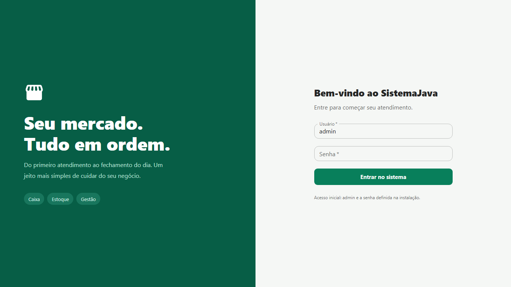
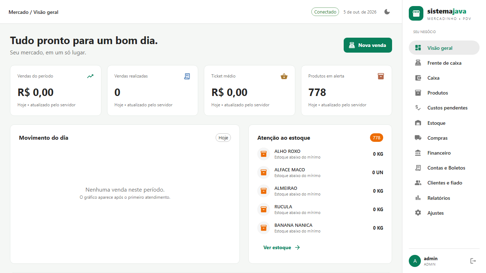

### PDV em ação
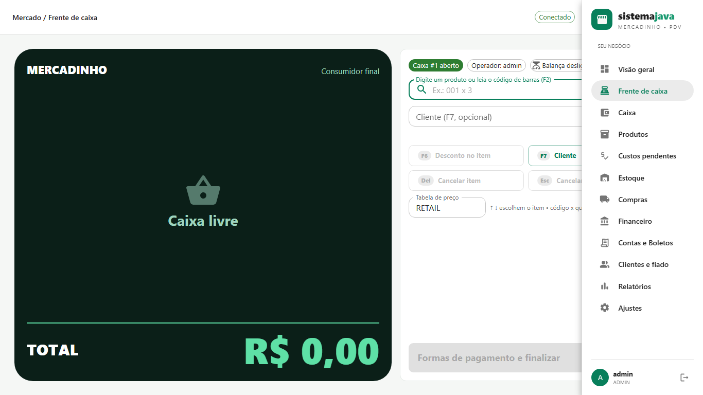
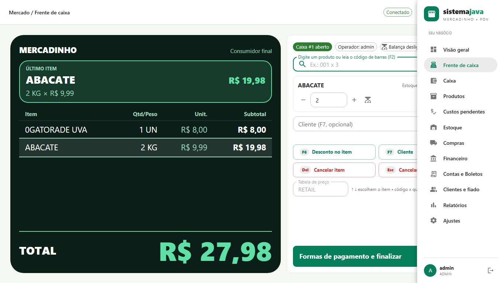
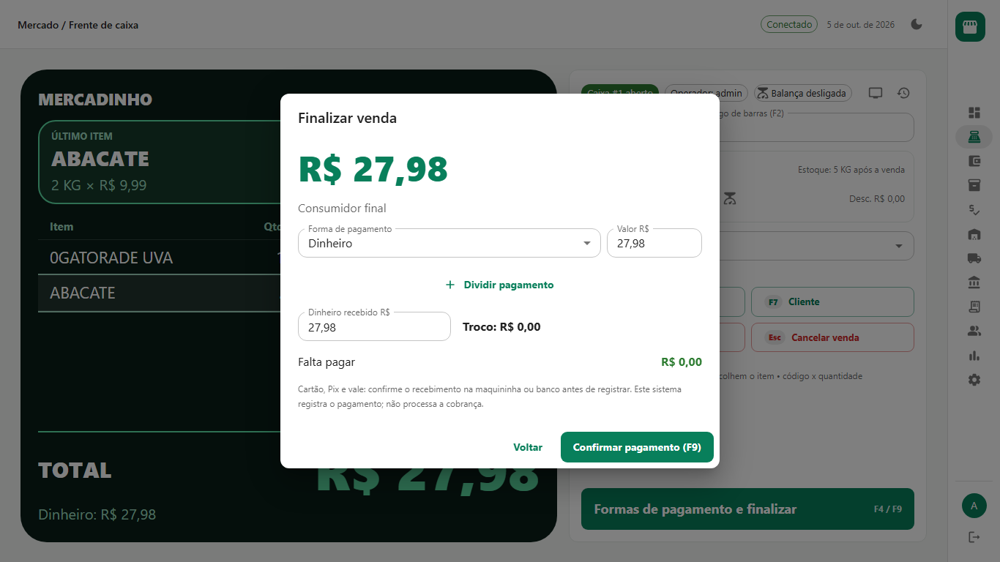

### Gestão do negócio
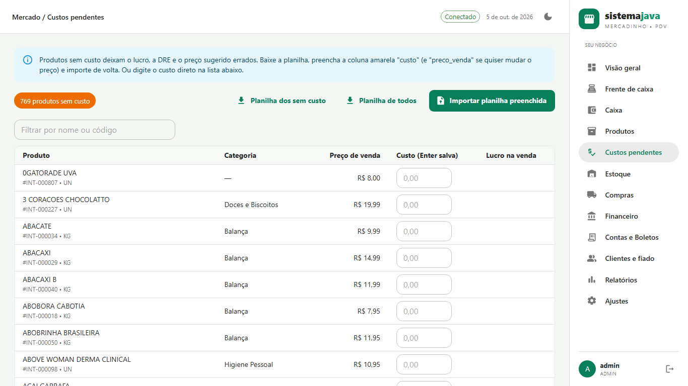
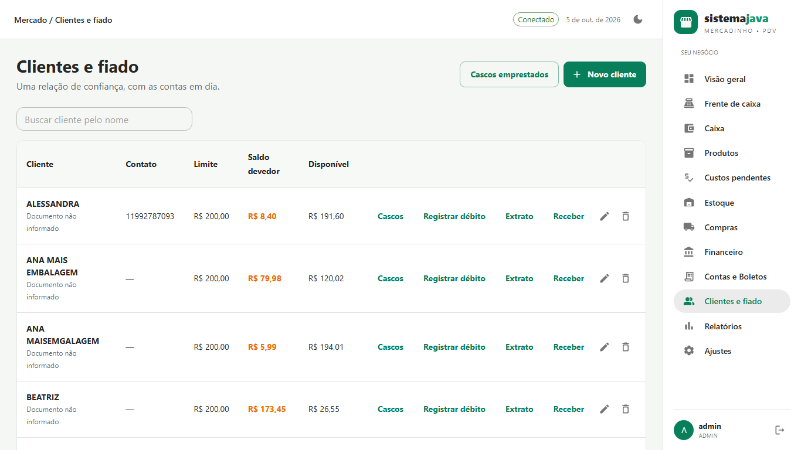
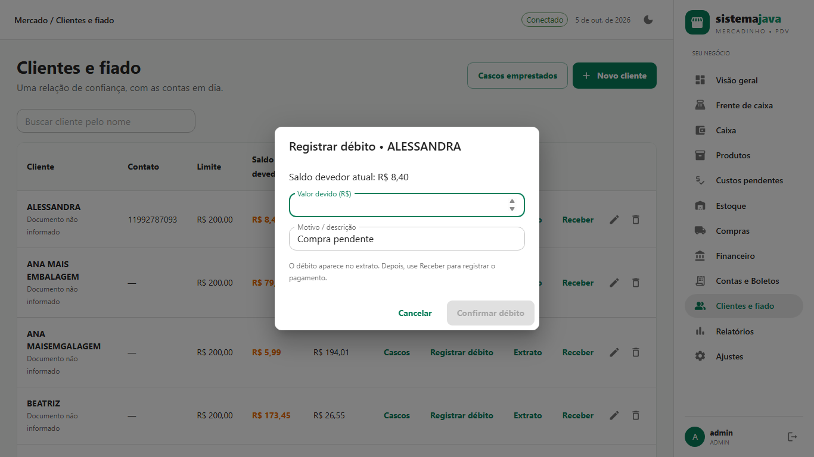
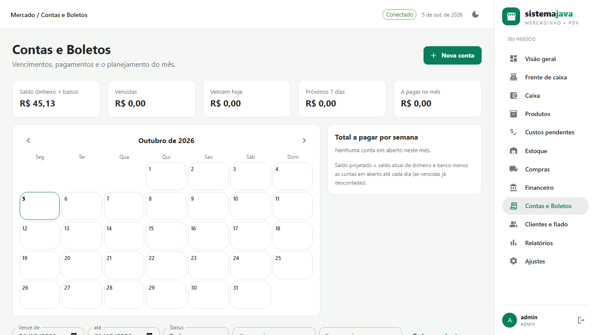

### Operação e configuração
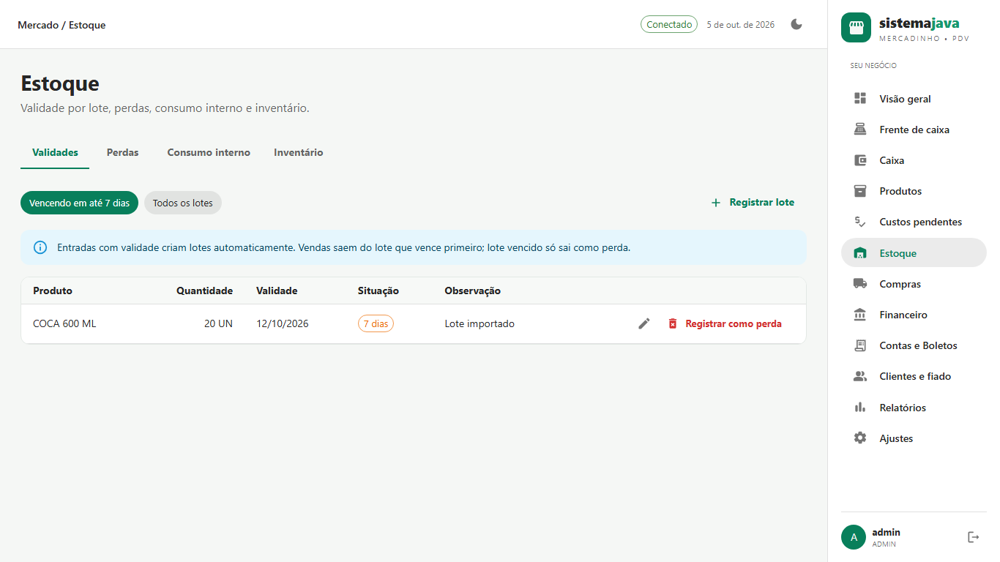
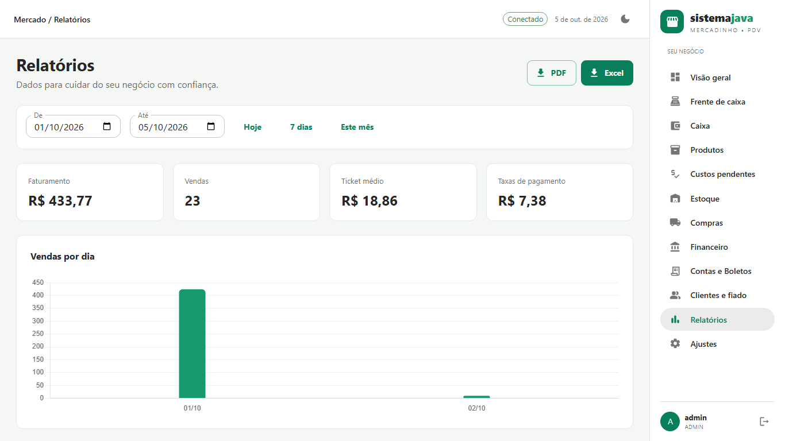
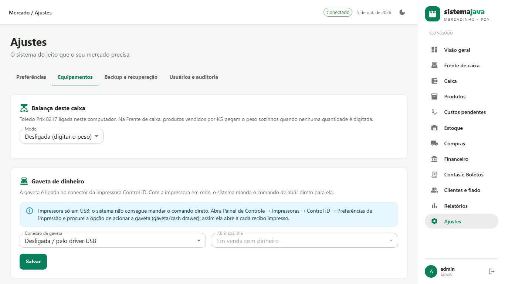

Todas as imagens estão em [`portfolio/`](portfolio/).

---

## Destaques técnicos

- **Arquitetura limpa:** backend em camadas (controllers, serviços, repositórios), frontend com React Router, Redux Toolkit e RTK Query.
- **Testes automatizados:** backend com JUnit 5 e Testcontainers, frontend com Jest, Testing Library e Cypress end-to-end.
- **Deploy simples:** um único `docker compose up` sobe backend, frontend e banco de dados.
- **Backup e recuperação:** rotina automática com `pg_dump`, retenção configurável e restauração administrativa.
- **Portfólio pronto:** todas as telas foram capturadas em alta resolução para apresentações e propostas.

---

## Ideal para

- Pequenos mercados e mercearias que precisam de um PDV local e confiável.
- Empresários que querem controle de estoque, fiado e financeiro integrado.
- Operações que precisam de auditoria e controle por usuário.
- Quem busca uma solução sem depender de internet ou serviços em nuvem.

---

## Contrate

Freelancer: [Felipe Ferreira dos Reis](https://www.upwork.com/freelancers/~019235568d9d0f6289)

Repositório: [github.com/FelipeFeerreira/retail-pos-java](https://github.com/FelipeFeerreira/retail-pos-java)

> Dados, marcas e valores exibidos nas screenshots são fictícios e servem apenas para demonstração.
