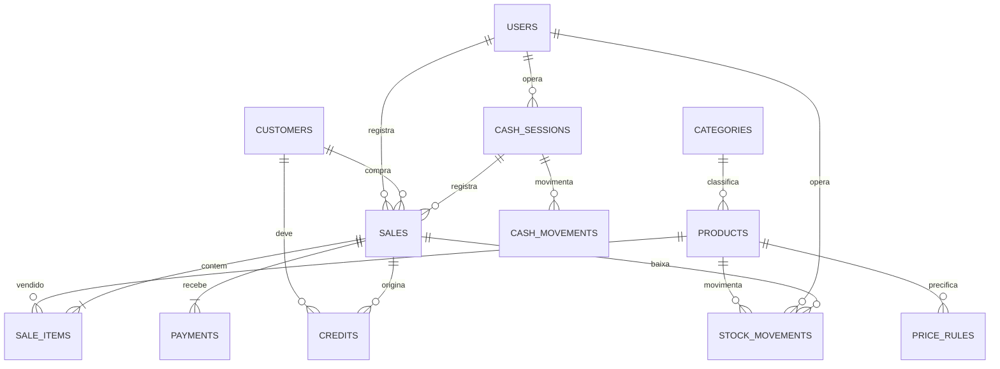

# Arquitetura e contratos

Java 17, Spring Boot 3.5, PostgreSQL 15, React 18, TypeScript e MUI. Backend em camadas: controllers validam contratos, services aplicam regras transacionais e repositories persistem entidades JPA. MapStruct converte produtos em DTOs. Flyway controla evolução do schema. HikariCP limita conexões por instância.

## Modelo de dados

Tabelas adicionais: settings (preferências individuais e configuração da loja), printers, scales e audit_log. As quantidades usam NUMERIC(14,3); valores monetários usam NUMERIC(14,2). Produtos e clientes são arquivados, preservando referências históricas. O item da venda guarda nome, preço, unidade e custo praticados.

## Fechamento e concorrência

1. Trava consultiva transacional PostgreSQL pela chave UUID de idempotência.
2. Se a chave já existe, retorna o mesmo recibo.
3. Bloqueia o caixa aberto do operador (sem caixa aberto a venda é recusada), depois cliente, depois produtos em ordem crescente de ID com SELECT FOR UPDATE.
4. Revalida unidade, estoque, validade, descontos, regra de preço e soma dos pagamentos.
5. Valida limite do fiado e atualiza saldo.
6. Persiste venda, itens, pagamentos, movimentos, dívida e auditoria numa transação.
7. Notifica clientes WebSocket somente depois do commit.

Desconto é um valor absoluto por linha, não porcentagem. A linha é arredondada HALF_UP para centavos antes de subtrair o desconto. Pagamentos devem somar o valor líquido exato; dinheiro entregue e troco são tratados no caixa, sem inflar a receita.

Pagamentos por cartão/Pix/vale são registros de recebimentos confirmados externamente. Não existe integração com adquirente ou iniciação de Pix. Cancelamento estorna estoque e fiado. Se o caixa da venda ainda está aberto, o dinheiro sai do esperado automaticamente; se já foi fechado, o valor em dinheiro vira sangria "Estorno venda #N" no caixa aberto de quem cancela (recusado sem caixa aberto ou sem dinheiro suficiente). Devolução de cartão/Pix deve ser conciliada pelo operador. Cancelamento de fiado já parcialmente pago é bloqueado para evitar perda de conciliação.

## Controle de caixa

Cada operador tem no máximo um caixa aberto (índice único parcial). Abertura registra o fundo de troco; suprimento e sangria exigem motivo, e sangria não pode exceder o dinheiro esperado. Dinheiro esperado = fundo + pagamentos CASH de vendas concluídas do caixa + suprimentos − sangrias. No fechamento o operador informa o dinheiro contado; o sistema grava esperado, contado e diferença, que ficam congelados. Sangria, suprimento e fechamento travam a linha do caixa, serializando com as vendas. Caixa vê somente os próprios caixas; gerente e administrador veem e podem fechar todos. Recebimentos de fiado em Clientes não entram no caixa.

## Estoque, compras e produção

Lotes (stock_lots) detalham a validade do estoque; a soma nunca passa de products.quantity e o que fica fora dos lotes é estoque sem validade. Toda saída (venda, perda, consumo, produção, saída manual) chama LotService.consume antes de baixar o produto: consome primeiro o lote que vence antes, recusa vender quantidade vencida e exige lote datado para perecível. lot_consumptions guarda o que cada saída usou; o cancelamento da venda devolve aos mesmos lotes depois de travar os produtos. products.expires_on passa a ser a validade do primeiro lote aberto.

Compras (purchases) recebem uma nota com vários produtos: custo médio ponderado, lote se houver validade e novo preço opcional com price_history. Receitas e produções consomem insumos a custo e criam lote do produto final.

## Financeiro

ledger_entries é o livro das contas (CASH = gaveta e cofre, BANK = banco); lançamentos não são editados, só estornados (reversal_of único). Venda em dinheiro entra em CASH, Pix no BANK líquido de taxa, cartão vira card_receivables até a liquidação. Fiado em dinheiro conta no esperado da gaveta e entra em CASH; outras formas no BANK. A diferença no fechamento do caixa é lançada em CASH. Compras viram payables ("Mercadoria para revenda"); compra à vista é paga na hora. A DRE usa competência: receita, taxas (reais quando liquidadas), CMV pelo custo do item vendido, perdas, consumo interno e despesas por categoria, sem somar compras de mercadoria.

## Segurança

JWT HS256 de uma hora, somente em memória no navegador; login e reinício da página exigem autenticação. Senhas BCrypt custo 12. CSRF double-submit cookie com SameSite=Strict e cabeçalho X-XSRF-TOKEN; inclusive login exige CSRF. Login possui bloqueio por nome após 10 tentativas em 15 minutos. O limitador é local à instância; configure rate limit global no proxy em múltiplas réplicas.

Papéis são verificados nos endpoints: caixa atende e cadastra clientes sem conceder crédito; gerente mantém catálogo, regras e relatórios; administrador também configura equipamentos, usuários, backup e auditoria. Senhas nunca são serializadas. Dados confidenciais não devem ser colocados em logs.

WebSocket nativo com STOMP: /ws/updates; CONNECT exige Bearer JWT; SUBSCRIBE aceita apenas /topic/updates; SEND é proibido. Eventos contêm apenas o tipo de atualização. O cliente invalida cache e consulta novamente a API autenticada.

O broker simples é local ao processo. Para múltiplas réplicas, use broker relay RabbitMQ/ActiveMQ, rate limiter distribuído e um único agendador de backup. Sessões HTTP não armazenam autenticação. Não ative cache de estoque ou saldo sem estratégia explícita de invalidação.

## API

OpenAPI gerado: /v3/api-docs. Swagger UI: /swagger-ui.html.

| Recurso | Métodos |
|---|---|
| /api/v1/auth/csrf | GET token CSRF |
| /api/v1/auth/login | POST credenciais |
| /api/v1/products | GET paginado, POST |
| /api/v1/products/{id} | GET, PUT, DELETE (arquiva) |
| /api/v1/products/{id}/price | GET ?table=RETAIL |
| /api/v1/products/import | POST multipart CSV/XLSX |
| /api/v1/products/export | GET ?format=csv ou xlsx |
| /api/v1/categories | GET, POST |
| /api/v1/categories/{id} | PUT, DELETE |
| /api/v1/stock-movements | GET ?productId=, POST |
| /api/v1/alerts | GET estoque mínimo e validade em até 7 dias |
| /api/v1/price-rules | GET, POST |
| /api/v1/price-rules/{id} | DELETE |
| /api/v1/sales | GET, POST transacional |
| /api/v1/sales/{id} | GET recibo completo |
| /api/v1/sales/{id}/items | GET |
| /api/v1/sales/{id}/cancel | POST gerente/admin |
| /api/v1/cash/current | GET caixa aberto do operador (204 se fechado) |
| /api/v1/cash/open | POST fundo de troco |
| /api/v1/cash/sessions | GET paginado |
| /api/v1/cash/sessions/{id} | GET resumo |
| /api/v1/cash/sessions/{id}/movements | POST sangria/suprimento |
| /api/v1/cash/sessions/{id}/close | POST dinheiro contado |
| /api/v1/lots | GET ?productId=&days=, POST; PUT /{id} |
| /api/v1/writeoffs | GET ?kind=LOSS/INTERNAL, POST; GET /summary |
| /api/v1/inventory-counts | GET |
| /api/v1/products/{id}/price-history | GET |
| /api/v1/products/catalog | GET tabela de preços XLSX |
| /api/v1/suppliers | GET, POST; PUT /{id} |
| /api/v1/purchases | GET, POST; GET /{id} |
| /api/v1/recipes e /api/v1/productions | receitas e lotes produzidos |
| /api/v1/finance/... | overview, accounts, entries, transfers, payables, card-receivables, dre, cashflow, statements |
| /api/v1/customers/{id}/titles | GET títulos com juros e multa |
| /api/v1/customers/{id}/bottles e /api/v1/bottles | cascos |
| /api/v1/reports/analytics | GET ?from&to |
| /api/v1/customers | GET, POST |
| /api/v1/customers/{id} | PUT, DELETE |
| /api/v1/credits | GET ?customerId= |
| /api/v1/credits/payments | POST recebimento |
| /api/v1/credits/overdue | GET |
| /api/v1/reports | GET ?from=YYYY-MM-DD&to=YYYY-MM-DD |
| /api/v1/reports/export | GET mesmos parâmetros + format=pdf ou xlsx |
| /api/v1/settings | GET, PUT |
| /api/v1/printers e /api/v1/scales | GET, POST; DELETE /{id} |
| /api/v1/scale/weight | GET leitura simulada |
| /api/v1/users | GET, POST administrador |
| /api/v1/audit-log | GET paginado administrador |
| /api/v1/backup | GET lista, POST cria |
| /api/v1/backup/restore | POST filename + confirmation=RESTAURAR |

Erros de validação: 400; sem autenticação: 401; perfil/CSRF: 403; inexistente: 404; conflito: 409; regra de negócio: 422.

## Extensibilidade e limites operacionais

ScaleAdapter é uma interface Spring, com MockScaleAdapter selecionado por SCALE_MODE=mock. A leitura simulada é marcada como simulated=true e retorna 0,750 kg. A integração serial depende de um adaptador específico e deve validar checksum, estabilidade, timeout e unidade antes de uso real.

A impressão usa o driver local via navegador; suporta selecionar impressoras USB ou filas CUPS já instaladas no sistema operacional. Não envia comandos ESC/POS crus nem instala drivers.

Validade é por produto, sem lote/FEFO. Recibos são não fiscais: não há emissão NFC-e/SAT, SPED ou cálculo tributário fiscal. As taxas de pagamento são custos financeiros. Operação em produção requer validar os requisitos fiscais e os equipamentos do estabelecimento.
